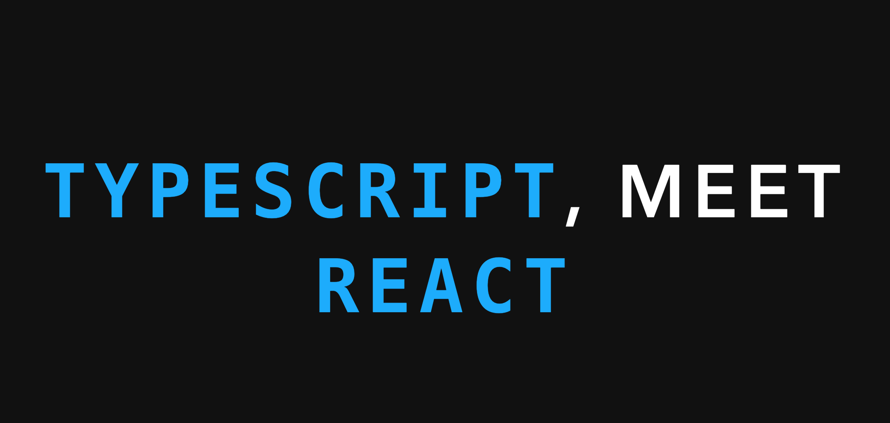

Over the last week, I've refurbished and updated a talk I gave at [SoCal React in July 2017](https://www.meetup.com/socal-react/events/240559282/) called "TypeScript, meet React".

I've been fond of TypeScript for a couple years now: I think that JavaScript is an incredible delivery platform for apps hidden underneath a bad language. TypeScript takes a lot of my issues with building consistent, reliable applications, and brings them to the front and center with compile-time errors.

There's many TypeScript success stories out there, and here's another addition: it's been a great addition to the [Byteconf](https://byteconf.com) stack. Rails compiles JS bundles as part of the deploy process, so there's been multiple instances that the TypeScript layer has stopped a bad deploy from going out. It's a great addition to any hobby project if only to save your butt.

[Here's the slides from the talk](https://lucid-volhard-5fde8c.netlify.com/). Of course, some of the vibe of the talk is missed by not actually hearing the presentation part: I may flesh it out and try and present it again at some local meetups - maybe I'll add some video of that in the future if I get around to that stage.

The source for the slides is [available on GitHub](https://github.com/signalnerve/react-typescript-talk) as well.

